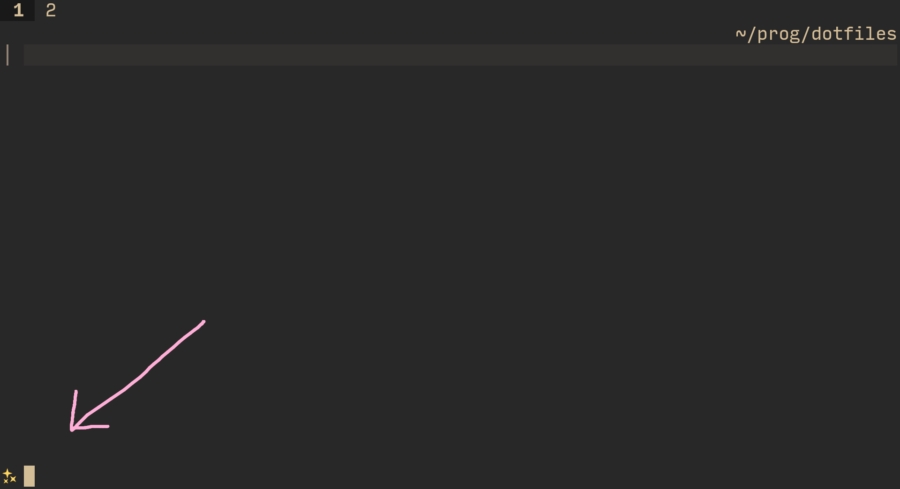
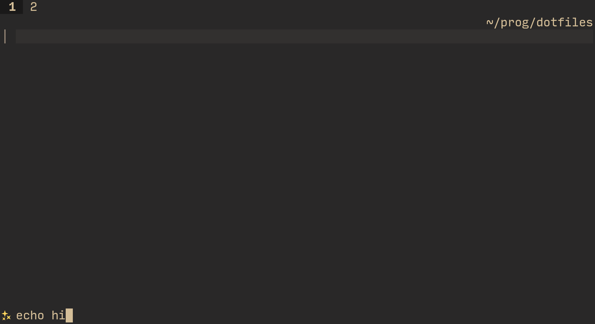
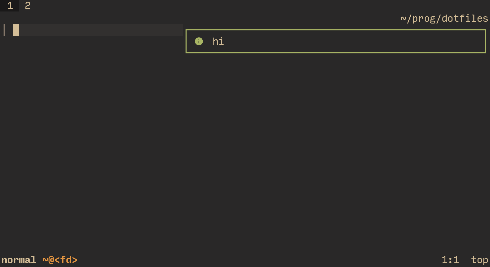
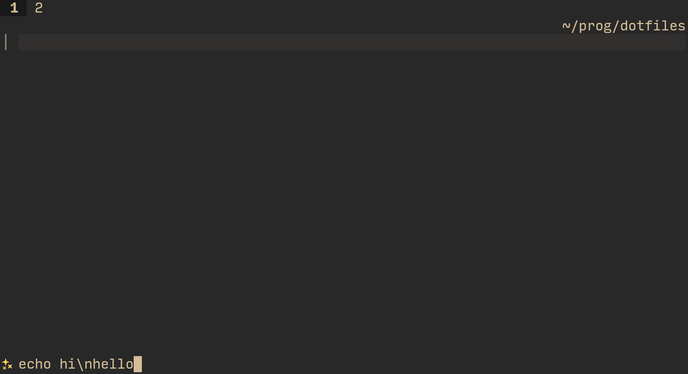
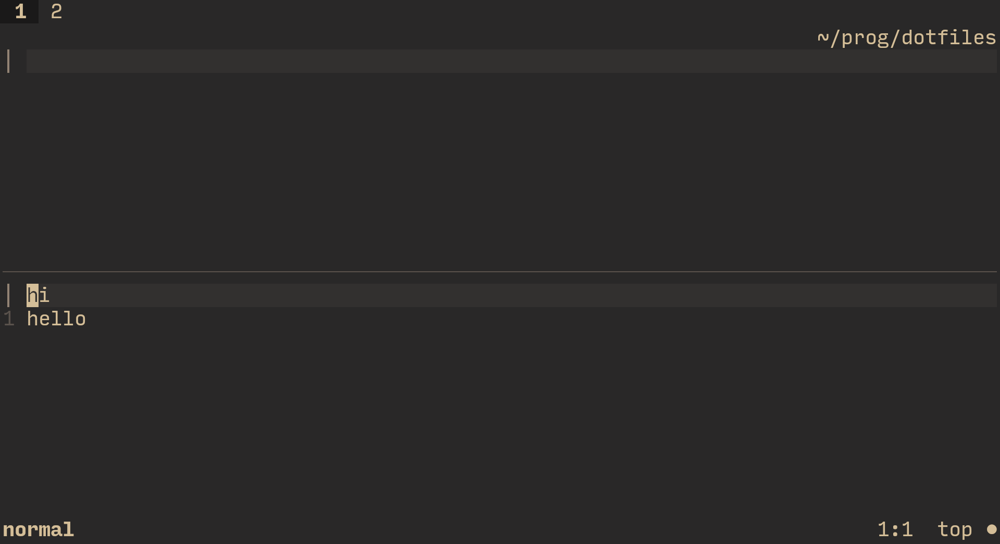
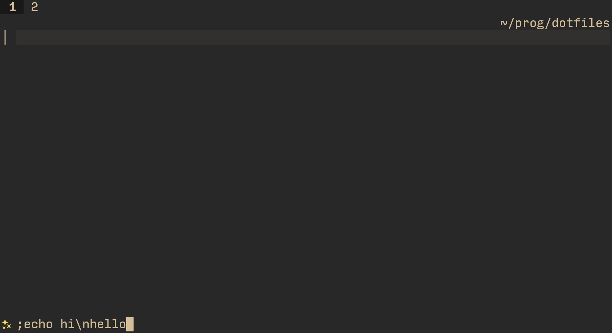
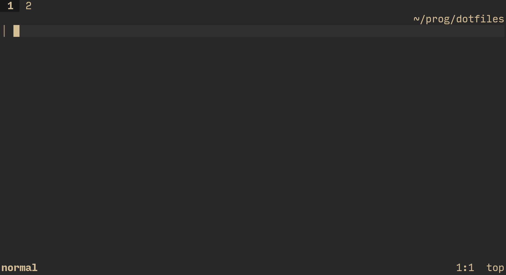

# wife.nvim

> A pun on `ex` mode.

WARNING: I expect you to have the latest stable neovim version.

Executing shell commands in neovim is kind of a hassle.

`:term` is ugly, `:!` "Press ENTER"s you to death, and opening a new terminal split moves around the ui a bit too much.

This plugin provides a nice interactive shell command execution experience for you. \
Press your mapping (suggested later), and you'll see an input prompt:



Type in whatever shell command you want (redirection and piping and stuff like that is supported):



To cancel, press <kbd>Escape</kbd>. If you want to accept, press <kbd>Enter</kbd>.



Because the output of this command is just a single line, it's displayed using `vim.notify`. \
If you have [`nvim-notify`](https://github.com/rcarriga/nvim-notify) installed, you'll see output the same way I do, in that screenshot. \
Otherwise, it will appear in `:messages`.

If the command produces more than one line of output, though,



The output will be shown in a new split:



Fun fact! This retains history! \
Press <kbd>ctrl+n</kbd> to go forward in history, and <kbd>ctrl+p</kbd> to go backward in history; \
<kbd>Up</kbd> and <kbd>Down</kbd> arrow keys will take the string you type in into account, to only show matches that start with that string.

This feature is not specific to this plugin, and is automatically provided by `vim.fn.input()`, which is used under the hood.

Often times, you don't care about the output of some commands: you only care if they failed or not. \
A good example of that is git — you usually don't care about the (useless) output of `git commit -m "message"`, as long as it succeeded.

If you put `;` (configurable) as the first character in your shell command:



, it (is removed from the command and) means "only show output if the command failed".



I pressed <kbd>Enter</kbd>, but this time I got no output! \
This is because the command succeeded.

Command execution is *syncronous* for reasons explained in issue #1. \
If a command you ran is taking worryingly long, you can always press <kbd>ctrl+c</kbd> to cancel it.

## Installation

With lazy.nvim:
```lua
---@type LazyPluginSpec
return {
    'Axlefublr/wife.nvim',
    lazy = true,
    -- This is where you should change the plugin's options,
    -- if you want to change any.
    -- If you don't, you don't even have to have `opts`.
    -- (Meaning, the setup() call is not required in that case).
    ---@module "wife"
    ---@type WifeOpts
    opts = {},
}
```

And somewhere in your configuration, you should make a mapping that opens the interactive shell:

```lua
vim.keymap.set('n', 'cm', function() require('wife').interactive_shell() end)
```

or maybe

```lua
['cm'] = {
    function() require('wife').interactive_shell() end,
},
```

or

```lua
keys = {
    { 'cm', function() require('wife').interactive_shell() end }
},
```

(I'm just throwing the possible syntaxes at you so you don't have to bother converting, whichever one you use actually is)

## Defaults

```lua
---@class WifeOpts
---Prompt for `require('wife').interactive_shell()`.
---Can be false to make lazy.nvim `opts` table merging easier.
---You can basically pass `false` to mean `nil`.
---@field prompt string|`false`|nil
---Path to the shell you want `interactive_shell` to use.
---All the other public functions in this plugin don't care about this option.
---(and they use the `shell` option automatically)
---@field shell string?
---If you put *this character* (or string) as the first thing in
---your `require('wife').interactive_shell()` command,
---only errors are going to be displayed;
---Meaning, output on successful execution of the shell command is ignored.
---@field errorer string?
---Amount of lines, after which the output appears in a split.
---If you set it to 3, 3 lines of output will appear in `vim.notify`,
---and 4 and beyond will appear in a split.
---@field cutoff integer?

---@type WifeOpts
local plugin_opts = {
    prompt = '󱕅 ',
    shell = vim.o.shell,
    errorer = ';',
    cutoff = 1
}
```

## Extra

I lied: the prompt isn't yellow by default. To change it, change the `WifePrompt` highlight group. \
You can usually do this in your colorscheme's configuration, or using `:h nvim_set_hl()`.

The plugin also provides convenient apis that it's using, all to you!

Here's a short overview (for more details, read the comments in the [source code](./lua/wife/init.lua)):

```lua
require('wife').shell(cmd, opts, on_exit)
```

Acts very similar in usage to `vim.system`, but assumes `cwd` to be the current neovim `cwd` and sets the `text` option to `true` (you can still override both of those, though).

```lua
require('wife').display(output, only_errors)
```

Takes what `vim.system():wait()` or `require('wife').shell():wait()` return, and displays it in a `vim.notify` or a split.

```lua
require('wife').shell_display(cmd, only_errors, opts)
```

Execute shell command with `require('wife').shell()` and display the output with `require('wife').display()`.

```lua
require('wife').input(prompt, default, completion)
```

The nice `vim.fn.input()` abstraction used by the plugin.

Has better lsp completions than the default (if you use lazydev.nvim), \
Can take `{ 'prompt', 'highlight_group' }` instead of just `'prompt'` to color it however you wish, \
Returns `nil` when you press <kbd>Escape</kbd>, rather than an empty string.
