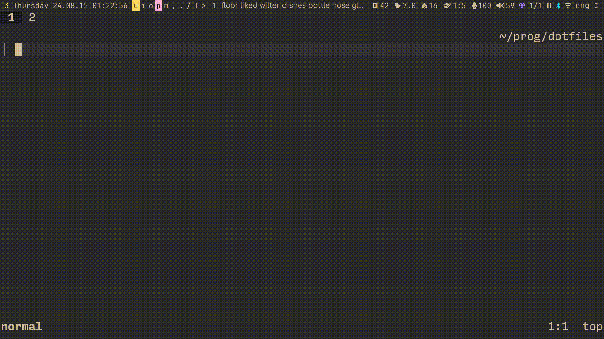

# wife.nvim

> A pun on `ex` mode.

WARNING: I expect you to have the latest stable neovim version.

Executing shell commands in neovim is kind of a hassle.

`:term` is ugly, `:!` "Press ENTER"s you to death, and opening a new terminal split moves around the ui a bit too much.

This plugin provides a nice interactive shell command execution experience for you:



Press The™ Wife™ Mapping™ (suggested later) and you come at a prompt. \
It uses `vim.ui.input` under the hood, and only looks so pretty to me because I use [`dress.nvim`](https://github.com/Axlefublr/dress.nvim).

Using that plugin is completely optional; without it you'll get a command-mode like look.

Type in whatever shell command you want (redirection and piping and stuff like that is supported), then <kbd>Enter</kbd> to accept your input. \
To cancel, press <kbd>Escape</kbd>. For _default_ `vim.ui.input`, at least; For the one shown in the gif above, you have to press it twice, because you have to go to normal mode first.

If the output of your command is just one (configurable) line, it's displayed using `vim.notify`. \
If you have [`nvim-notify`](https://github.com/rcarriga/nvim-notify) installed, you'll see output the same way I do, in that showcase gif. \
Otherwise, it will appear in `:messages`. (In other words, this plugin is optional too (any `vim.notify` replacer should work, fwiw (including `noice.nvim` I assume (yes I'm writing lisp in a readme, what about it))))

If the command produces more than one (configurable) line of output, though, the output will be shown in a new split.

Often times, you don't care about the output of some commands: you only care if they failed or not. \
A good example of that is git — you usually don't care about the (useless) output of `git commit -m "message"`, as long as it succeeded.

If you put `;` (configurable) as the first character in your shell command, it (is removed from the command and) means "only show output if the command failed".

This is the reason why the last command I executed in that showcase didn't show any output — it succeeded.

I was able to make input getting asyncronous (`vim.ui.input`),
but command execution is _syncronous_ because of neovim callback restrictions. \
If a command you ran is taking worryingly long, you can always press <kbd>ctrl+c</kbd> to cancel it.

## Installation

With lazy.nvim:

```lua
---@type LazyPluginSpec
return {
    'Axlefublr/wife.nvim',
    lazy = true,
    -- This is where you should change the plugin's options,
    -- if you want to change any.
    -- Even if you don't, keep this `opts = {}` to make sure
    -- the `setup()` function gets called
    ---@module "wife"
    ---@type WifeOpts
    opts = {},
    dependencies = {
        -- Optional; makes single line output displayed in a neat notification,
        -- rather than in `:messages`.
        -- If you set the `cutoff` option to 0 because you always want to see the
        -- output in a split, this plugin won't do anything anyway.
        { 'rcarriga/nvim-notify', opts = {} },
        -- Optional; makes the input box look nice.
        -- `dressing.nvim` and other `vim.ui.input` replacing plugins will also work,
        -- I just happen to like this implementation the best (no wonder, I made it)
        { 'Axlefublr/dress.nvim', opts = {} },
    }
}
```

And somewhere in your configuration, you should make a mapping that opens the interactive shell (unless you actually came to this plugin exclusively for the api all along 🤯):

```lua
vim.keymap.set('n', 'cm', function() require('wife').interactive_shell() end)
```

or maybe

```lua
['cm'] = {
    function() require('wife').interactive_shell() end,
},
```

or

```lua
keys = {
    { 'cm', function() require('wife').interactive_shell() end }
},
```

(I'm just throwing the possible syntaxes at you so you don't have to bother converting, whichever one you use actually is)

## Defaults

```lua
---@class WifeOpts
---
---Prompt for `require('wife').interactive_shell()`.
---To disable the prompt, you can set it to an empty string.
---@field prompt string|nil
---
---If you put *this character* (or string) as the first thing in
---your `require('wife').interactive_shell()` command,
---only errors are going to be displayed;
---Meaning, output on successful execution of the shell command is ignored.
---@field errorer string?
---
---Amount of lines, after which the output appears in a split.
---For example, if you set it to 3, 3 or less lines of output
---will appear in `vim.notify`, 4 or more will appear in a split.
---@field cutoff integer?

---@type WifeOpts
local plugin_opts = {
    prompt = 'shell ',
    errorer = ';',
    cutoff = 1,
}
```

## Extra

The plugin also provides convenient apis that it's using, all to you!

Here's a short overview (for more details, read the comments in the [source code](./lua/wife/init.lua)):

---

```lua
require('wife').shell(cmd, opts, on_exit)
```

Acts very similar in usage to `vim.system`, but assumes `cwd` to be the current neovim `cwd` and sets the `text` option to `true` (you can still override both of those, though).

```lua
require('wife').display(output, only_errors)
```

Takes what `vim.system():wait()` or `require('wife').shell():wait()` return, and displays it in a `vim.notify` or a split.

```lua
require('wife').shell_display(cmd, only_errors, opts)
```

Execute shell command with `require('wife').shell():wait()` and display the output with `require('wife').display()`.
